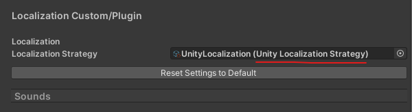
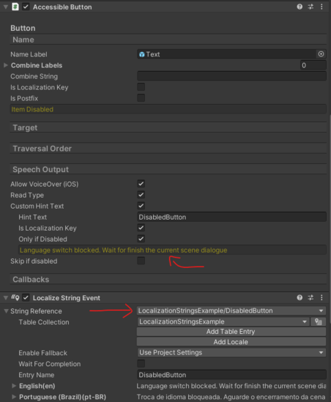
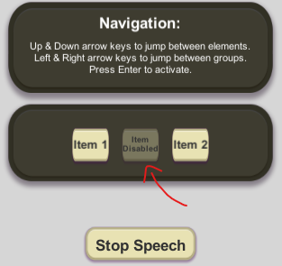

# UnityAccessibilityPlugin: Unity Localization integration

[](https://openupm.com/packages/com.metalpopgames.uiaccessibility.unity-localization/)

The **UI Accessibility Plugin** ([UAP](https://github.com/mikrima/UnityAccessibilityPlugin)) integration with [com.unity.localization](https://docs.unity3d.com/Packages/com.unity.localization@1.4/manual/index.html).

Allows you to use localized tables and keys to localize texts on accessible UI elements using UAP plugin.

## Feature Overview

- Contains [`UnityLocalizationStrategy.asset`](./Runtime/Resources/ScriptableObjects/UnityLocalization.asset) ScriptableObject that implements `LocalizationStrategy` from **com.metalpopgames.uiaccessibility**
  main UPM package. You can assign it on Unity Editor inspector, when select the gameObject **`Accessibility Manager`** => `Settings` group.

- Default [String Table](https://docs.unity3d.com/Packages/com.unity.localization@1.4/manual/StringTables.html) to test the translation integration from samples scenes.

- Supports multiple languages (and more can be added)

## Supported Platforms

-  Android

-  iOS

-  Windows (Windows SAPI and NVDA)

-  Mac

-  [WebGL](https://caniuse.com/webgl2) (some limitations apply)

## Installation

## OpenUPM

Install the [OpenUPM](https://openupm.com) CLI and add the [com.metalpopgames.uiaccessibility.unity-localization](https://openupm.com/packages/com.metalpopgames.uiaccessibility.unity-localization) package

```bash

# Install node (e.g using NVM)
curl -o- https://raw.githubusercontent.com/nvm-sh/nvm/v0.39.5/install.sh | bash
# "node" is an alias for the latest version
nvm install node
# You can list available versions using "ls-remote"
nvm ls-remote
# or 16.3.0, 12.22.1, etc
nvm install 14.7.0

# Install openupm-cli
npm install -g openupm-cli

# Go to your Unity project directory
cd YOUR_UNITY_PROJECT_DIR

# Install package: com.metalpopgames.uiaccessibility.unity-localization
openupm add com.metalpopgames.uiaccessibility.unity-localization

```

Or alternatively, merge the snippet below to [Packages/manifest.json](https://docs.unity3d.com/Manual/upm-manifestPrj.html) manually

```jsonc
{
    // Verifiy which is the latest tag in this repository
    "dependencies": {
        "com.metalpopgames.uiaccessibility.unity-localization": "<LATEST_VERSION>"
    },
    // If you already have the openupm registry,
    // only add this package to "scopes" array
    "scopedRegistries": [
        {
            "name": "package.openupm.com",
            "url": "https://package.openupm.com",
            "scopes": [
                "com.metalpopgames.uiaccessibility.unity-localization"
            ]
        }
    ]
}
```

## Github package

1. Add a **`$HOME/.upmconfig.toml`** file with the TOKEN to authenticate on registry

    ```toml
    [npmAuth."https://npm.pkg.github.com/@mfdeveloper"]
    # Generate the token from your github profile:
    # https://github.com/settings/tokens
    _authToken = "<TOKEN-VALUE>"
    email = "<YOUR_EMAIL>"
    alwaysAuth = true
    ```

    > **WARNING:** _GitHub/Gitlab_ Packages registry always requires authentication. For **_private_** and **_public_** packages.

2. Configure the scope **registry** and **dependency** in your Unity project `Packages/manifest.json`

    ```jsonc
    {
        "dependencies": {
            // Verifiy which is the latest tag in this repository
            "com.metalpopgames.uiaccessibility.unity-localization": "<LATEST_VERSION>"
        },
        "scopedRegistries": [
            {
                "name": "Github Packages: mfdeveloper",
                "url": "https://npm.pkg.github.com/@mfdeveloper",
                "scopes": [
                    "com.metalpopgames"
                ]
            }
        ]
    }
    ```

## Git dependency

The minimal checked Unity Version is **`2019.3.*`** LTS

Open Package Manager and "Add package from git url..." using next string:

- `https://github.com/mfdeveloper/UnityAccessibilityPlugin.git#upm`

Or use the latest git release/tag:

- `https://github.com/mfdeveloper/UnityAccessibilityPlugin.git#<LATEST_VERSION>`

You also can edit `Packages/manifest.json` manually, just add:

- `"com.metalpopgames.uiaccessibility.unity-localization": "https://github.com/mfdeveloper/UnityAccessibilityPlugin.gitt#<LATEST_VERSION>",`

## Local dependency (Embedded package)

1. Download or clone this repo from **git tag** `com.metalpopgames.uiaccessibility.unity-localization/<LATEST_VERSION>` branch

    ```bash

    git clone -b upm https://github.com/<repo_url>.git

    ```

2. Copy the content of root folder into your project's `Packages` folder.

## Getting Started

1. Select the gameObject on scene `AccessibilityManager`

2. On Unity Editor inspector, click on **`Settings`** section group. Scroll down to the end, and assign `UnityLocalizationStrategy.asset` to `LocalizationStrategy` field.

    

3. On Unity Editor, go to menu `Window` => `Asset Management` => `Localization Tables`. Create a string table and add a string _key_ with translations for locales (e.g _English_, _Portuguese_...)

4. Add any accessible UI element to your scene (e.g **Accessible Button**) and add a `Localize String Event` component of `com.unity.localization` plugin.

5. Configure your String reference with the previous table and _key_ reference. Then, use that key on any place of `UnityAccessibility` plugin (UAP) that allow pass a localization key (e.g on `Speech Output` => `Custom Hint Text` => `Hint text` of **Accessible Button** script)

6. You should see the translated string in your current locale language.

    

## Developers

UI elements need to be marked up as accessible so that the UAP can recognize them, read them aloud to users,
and allow interaction. This is done by adding accessibility-components to the GameObjects that are relevant

### Publish (Github Packages)

1. Install `node` (e.g using [NVM](https://github.com/nvm-sh/nvm))

2. Generate a [Github access token (classic)](https://docs.github.com/en/authentication/keeping-your-account-and-data-secure/managing-your-personal-access-tokens#creating-a-personal-access-token-classic)

3. Authenticate using the generated TOKEN:

   Create a user `$HOME/.npmrc` file

    ```ini
    # Where: <GITHUB_TOKEN> is the access token (classic) generated in your profile
    @github:registry=https://npm.pkg.github.com
    //npm.pkg.github.com/:_authToken=<GITHUB_TOKEN>
    ```

    Or, use the file `Packages/<PACKAGE_NAME>/.npmrc` that already exists in this repository:

    ```bash
    # Export the environment variable "$GITHUB_TOKEN"
    # the file ".npmrc" inside of this repo will use this variable
    export GITHUB_TOKEN=<GITHUB_TOKEN>
    ```

4. Publish the package with [npm publish](https://docs.npmjs.com/cli/v9/commands/npm-publish)

    From [`[upm-package-embedded]`](https://github.com/mfdeveloper/UnityAccessibilityPlugin/tree/upm-package-embedded) git branch

    ```bash
    # Clone this repo and checkout to branch "[upm-package-embedded]"
    git clone https://github.com/<REPOSITORY_URL>.git
    git checkout upm-package-embedded

    # Run the npm scripts
    npm install
    npm run publish:package # Publish from repository ROOT path
    npm run publish:package-localization # Publish the another package from monorepo repository

    cd Packages/<PACKAGE_NAME> 
    npm run pack:package # Pack in a .tgz for testing (optional)
    npm run package:publish-from-local # Publish from package path
    npm run publish:from-local # Or use this another script alias for publishing (optiona
    ``````

    > **WARNING:** Avoid use the common **`npm publish`** directly, because the hooks `prepare`, `prepublish` ... aren't triggered in this package. They have conflicts with [OpenUPM Azure pipelines](https://dev.azure.com/openupm/openupm/_build?definitionId=1&_a=summary) and fail when try run automation publishing tags to OpenUPM :(

### NPM Scripts (optional)

Optionally, you can run specific npm scripts inside of `Packages/<PACKAGE_NAME>` or from **`[upm]`** branch:

```bash
# Go to the package dir
cd Packages/<PACKAGE_NAME>

# Pack a .tgz for testing (optional)
npm run package:pack

# Run the publish script (with $PUBLISH_FORCE environment variable)
npm run package:publish-from-local
# Alias script to "package:publish-from-local" above
npm run publish:from-local
# Or simply run the command line below from any unix-like bash terminal
# (e.g from Git bash on Windows)
PUBLISH_FORCE=1 && npm run package:prepare && npm publish
```

## Documentation

The documentation, how-to guides and further examples can be found [here](http://www.metalpopgames.com/assetstore/accessibility/doc/index.html).<br/>
There's also a tutorial video demonstrating the basic setup: [Basic Tutorial Video](https://www.youtube.com/watch?v=SJuQWf7p9T4).<br/>
Here's a forum thread for discussion and support on the Unity forums: [UI Accessibility Plugin](https://forum.unity.com/threads/released-ui-accessibility-plugin-uap-v1-0.469298/?_ga=2.92342237.1961910733.1618848783-1844297938.1510951995)

## License & Asset Usage Rights

The UAP plugin itself is made available under the Apache 2.0 license. See included license file for details.<br/>
This license does **not** apply to the demo and example content.

## Example Scene

Import a scene from `Samples(or Samples~)/UINavigationLocalizationExample/Scenes`. There is an scene configured with `Item Disabled` gameObject
in order to simulate a **Custom Hint Text** with a localized _key_.



> Disabled `Accessible Button` with a localized **custom hint text**

## Third Party Licensing Terms

Windows only:<br/>
UAP includes the shared NVDA screen reader controller client library for 64 and 32 Bit.
The library can be found in the folders UAP/Plugins/x86 and UAP/Plugins/x86_64 respectively.
The NVDA Controller Client API is licensed under the GNU Lesser General Public License (LGPL), version 2.1 (Source)<br/>
In simple terms, this library can be used in any application, but cannot be modified.<br/>
Link to full license text: (<https://github.com/nvaccess/nvda/blob/master/extras/controllerClient/license.txt>)
