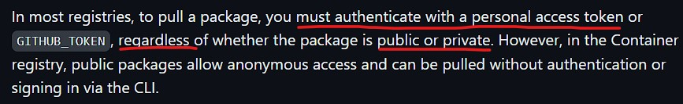

# UnityAccessibilityPlugin (UAP)

[](https://openupm.com/packages/com.metalpopgames.uiaccessibility/)

The UI Accessibility Plugin (UAP) allows you to make your UI accessible to blind and visually impaired players on Windows, Android, iOS, Mac and WebGL.
Tested in Unity 5.6 to Unity 2020.1.

## Feature Overview

- Full source code, including native code for Windows and Android libraries
- UGUI & NGUI compatible
- Supports multiple languages (and more can be added)
- Works like VoiceOver & TalkBack

## Supported Platforms

-  Android

-  iOS

-  Windows (Windows SAPI and NVDA)

-  Mac

-  [WebGL](https://caniuse.com/webgl2) (some limitations apply)

## Installation

## OpenUPM

Install the [OpenUPM](https://openupm.com) CLI and add the [com.metalpopgames.uiaccessibility](https://openupm.com/packages/com.metalpopgames.uiaccessibility) package

```bash

# Install node (e.g using NVM)
curl -o- https://raw.githubusercontent.com/nvm-sh/nvm/v0.39.5/install.sh | bash
# "node" is an alias for the latest version
nvm install node
# You can list available versions using "ls-remote"
nvm ls-remote
# or 16.3.0, 12.22.1, etc
nvm install 14.7.0

# Install openupm-cli
npm install -g openupm-cli

# Go to your Unity project directory
cd YOUR_UNITY_PROJECT_DIR

# Install package: com.metalpopgames.uiaccessibility
openupm add com.metalpopgames.uiaccessibility

```

### OpenUPM package

Follow the installation guide from: [openupm/com.metalpopgames.uiaccessibility](https://openupm.com/packages/com.metalpopgames.uiaccessibility)

Alternatively, merge the snippet below to [Packages/manifest.json](https://docs.unity3d.com/Manual/upm-manifestPrj.html) manually

```jsonc
{
    // Verifiy which is the latest tag in this repository
    "dependencies": {
        "com.metalpopgames.uiaccessibility": "<LATEST_VERSION>"
    },
    // If you already have the openupm registry,
    // only add this package to "scopes" array
    "scopedRegistries": [
        {
            "name": "package.openupm.com",
            "url": "https://package.openupm.com",
            "scopes": [
                "com.metalpopgames.uiaccessibility"
            ]
        }
    ]
}
```

## Github package

1. Generate an **access token** on your Github account, following the guide: [Creating a personal access token (classic)](https://docs.github.com/en/authentication/keeping-your-account-and-data-secure/managing-your-personal-access-tokens#creating-a-personal-access-token-classic).

2. Add a **`$HOME/.upmconfig.toml`** file with the TOKEN to authenticate on registry

    ```toml
    [npmAuth."https://npm.pkg.github.com/@mfdeveloper"]
    # Generate the token from your github profile:
    # https://github.com/settings/tokens
    _authToken = "<TOKEN-VALUE>"
    email = "<YOUR_EMAIL>"
    alwaysAuth = true
    ```

    > **WARNING:** _GitHub/Gitlab_ Packages registry always requires authentication. For **_private_** and **_public_** packages. If you don't have a Github account, or won't create a TOKEN, try use the [openupm](#openupm-package) package above.

    

3. Configure the scope **registry** and **dependency** in your Unity project `Packages/manifest.json`

    ```jsonc
    {
        "dependencies": {
            // Verifiy which is the latest tag in this repository
            "com.metalpopgames.uiaccessibility": "<LATEST_VERSION>"
        },
        "scopedRegistries": [
            {
                "name": "Github Packages: mfdeveloper",
                "url": "https://npm.pkg.github.com/@mfdeveloper",
                "scopes": [
                    "com.metalpopgames"
                ]
            }
        ]
    }
    ```

## Git dependency

The minimal checked Unity Version is **`2019.3.*`** LTS

Open Package Manager and "Add package from git url..." using next string:

- `https://github.com/mfdeveloper/UnityAccessibilityPlugin.git#upm`

Or use the latest git release/tag:

- `https://github.com/mfdeveloper/UnityAccessibilityPlugin.git#<LATEST_VERSION>`

You also can edit `Packages/manifest.json` manually, just add:

- `"com.metalpopgames.uiaccessibility": "https://github.com/mfdeveloper/UnityAccessibilityPlugin.gitt#<LATEST_VERSION>",`

## Local dependency (Embedded package)

1. Download or clone this repo from `[upm]` branch

    ```bash

    git clone -b upm https://github.com/<repo_url>.git
    
    ```

2. Copy the content of root folder into your project's `Packages/<PACKAGE_NAME>` folder.

3. Follow the Quick Start Guide either using the included PDF `Documentation/UAP_QuickStartGuide.pdf` or the online guide [here](http://www.metalpopgames.com/assetstore/accessibility/doc/QuickStart.html).

4. Watch the basic tutorial video on [Youtube](https://www.youtube.com/watch?v=SJuQWf7p9T4&ab_channel=MetalPopGames).

## Basic Functionality

This plugin brings screen reader functionality to Unity apps, making them usable for blind users (without making
them unusable for everyone else).

## Developers

UI elements need to be marked up as accessible so that the UAP can recognize them, read them aloud to users,
and allow interaction. This is done by adding accessibility-components to the GameObjects that are relevant.

### Publish (Github Packages)

1. Install `node` (e.g using [NVM](https://github.com/nvm-sh/nvm))

2. Generate a [Github access token (classic)](https://docs.github.com/en/authentication/keeping-your-account-and-data-secure/managing-your-personal-access-tokens#creating-a-personal-access-token-classic)

3. Authenticate using the generated TOKEN:

   Create a user `$HOME/.npmrc` file

    ```ini
    # Where: <GITHUB_TOKEN> is the access token (classic) generated in your profile
    @github:registry=https://npm.pkg.github.com
    //npm.pkg.github.com/:_authToken=<GITHUB_TOKEN>
    ```

    Or, use the file `Packages/<PACKAGE_NAME>/.npmrc` that already exists in this repository:

    ```bash
    # Export the environment variable "$GITHUB_TOKEN"
    # the file ".npmrc" inside of this repo will use this variable
    export GITHUB_TOKEN=<GITHUB_TOKEN>
    ```

4. Publish the package with [npm publish](https://docs.npmjs.com/cli/v9/commands/npm-publish)

    From [`[upm-package-embedded]`](https://github.com/mfdeveloper/UnityAccessibilityPlugin/tree/upm-package-embedded) git branch

    ```bash
    # Clone this repo and checkout to branch "[upm-package-embedded]"
    git clone https://github.com/<REPOSITORY_URL>.git
    git checkout upm-package-embedded

    # Run the npm scripts
    npm install
    npm run publish:package # Publish from repository ROOT path
    npm run publish:package-localization # Publish the another package from monorepo repository

    cd Packages/<PACKAGE_NAME>
    npm run pack:package # Pack in a .tgz for testing (optional)
    npm run package:publish-from-local # Publish from package path
    npm run publish:from-local # Or use this another script alias for publishing (optiona
    ``````

    > **WARNING:** Avoid use the common **`npm publish`** directly, because the hooks `prepare`, `prepublish` ... aren't triggered in this package. They have conflicts with [OpenUPM Azure pipelines](https://dev.azure.com/openupm/openupm/_build?definitionId=1&_a=summary) and fail when try run automation publishing tags to OpenUPM :(

### NPM Scripts (optional)

Optionally, you can run specific npm scripts inside of `Packages/<PACKAGE_NAME>` or from **`[upm]`** branch:

```bash
# Go to the package dir
cd Packages/<PACKAGE_NAME>

# Pack a .tgz for testing (optional)
npm run package:pack

# Run the publish script (with $PUBLISH_FORCE environment variable)
npm run package:publish-from-local
# Alias script to "package:publish-from-local" above
npm run publish:from-local
# Or simply run the command line below from any unix-like bash terminal
# (e.g from Git bash on Windows)
PUBLISH_FORCE=1 && npm run package:prepare && npm publish
```

## Blind Users

The controls are based on popular screen readers like VoiceOver, NVDA and TalkBack, so that blind users will not
have to relearn a new method of control.<br/>
The plugin will try to detect a screen reader running in the background and enable itself if it does. Otherwise
it will sit dormant and not interfere with the app (making it usable for non-blind users).

## Documentation

The documentation, how-to guides and further examples can be found [here](http://www.metalpopgames.com/assetstore/accessibility/doc/index.html).<br/>
There's also a tutorial video demonstrating the basic setup: [Basic Tutorial Video](https://www.youtube.com/watch?v=SJuQWf7p9T4).<br/>
Here's a forum thread for discussion and support on the Unity forums: [UI Accessibility Plugin](https://forum.unity.com/threads/released-ui-accessibility-plugin-uap-v1-0.469298/?_ga=2.92342237.1961910733.1618848783-1844297938.1510951995)

## License & Asset Usage Rights

The UAP plugin itself is made available under the Apache 2.0 license. See included license file for details.<br/>
This license does **not** apply to the demo and example content.

## Example Scene

All assets inside the Example folder (or its subfolders) of this plugin are for sample purposes only and cannot be redistributed, sold or used in your products (free or commercial).<br/>
The UI for the Match 3 game example was created by Vasili Tkach.<br/>
It is available for free here: [Funtique UI by Vasili Tkach](https://dribbble.com/shots/2261532--Funtique-game-UI-kit-free-PSD)

## Third Party Licensing Terms

Windows only:<br/>
UAP includes the shared NVDA screen reader controller client library for 64 and 32 Bit.
The library can be found in the folders UAP/Plugins/x86 and UAP/Plugins/x86_64 respectively.
The NVDA Controller Client API is licensed under the GNU Lesser General Public License (LGPL), version 2.1 (Source)<br/>
In simple terms, this library can be used in any application, but cannot be modified.<br/>
Link to full license text: (<https://github.com/nvaccess/nvda/blob/master/extras/controllerClient/license.txt>)

## FAQ

**_Does this make VoiceOver recognize my Unity app?_**</b><br/>
No. This plugin works and acts like a screen-reader - it does not expose Unity's UI to native screen readers.
It basically reimplements the functionality of VoiceOver (and then some). Exposing the UI tree to the native
screen readers is not feasible, because UGUI and NGUI don't work this way.
<br/><br/>
**_Can this plugin circumvent the problem with TalkBack blocking input?_**<br/>
TalkBack blocks input to Unity on an OS level, and this plugin can not circumvent that.
TalkBack can be detected if it is running, and the plugin can enable accessibility automatically, but the
input will still need to be unblocked by pausing TalkBack while interacting with the app.
The plugin will prompt the user to pause TalkBack.
<br/><br/>
**_On iOS 14 VoiceOver only says 'Direct Touch Area' - does the UAP not work in iOS 14?_**<br/>
UAP works fine in iOS 14. However, Apple changed the default behaviour for non-native UI views in this version of iOS.
As a result, many accessible apps now 'appear' to no longer work. But all the user has to do is reenable direct touch
using the rotor gesture. Blind users are familiar with this process (and have likely already changed the
OS default behaviour in their device settings). This topic has been discussed in several forum threads.<br/>
As this is caused by the OS, it isn't something that this plugin can automatically circumvent. It is possible
that future versions of Unity will register the correct view parameters and solve this issue.<br>
More on the topic can be found here: [Direct Touch Interaction Broken in iOS 14?](https://developer.apple.com/forums/thread/663529)
<br/><br/>
**_Can I delete the Examples folder?_**<br/>
Yes. It is safe to delete the entire "Examples" folder from the plugin if it isn't needed.<br/>
Also keep in mind that the assets used in the examples do not fall under the Apache 2.0 license, and cannot be
used in other projects. See section **License & Asset Usage Rights** further up on this page.
<br/><br/>
**_Is this plugin free to use in commercial projects?_**<br/>
Yes.<br/>
Please note that the assets used in the Examples folder do not fall under the Apache 2.0 license, and may not be
used in such projects. See section **License & Asset Usage Rights** further up on this page.
